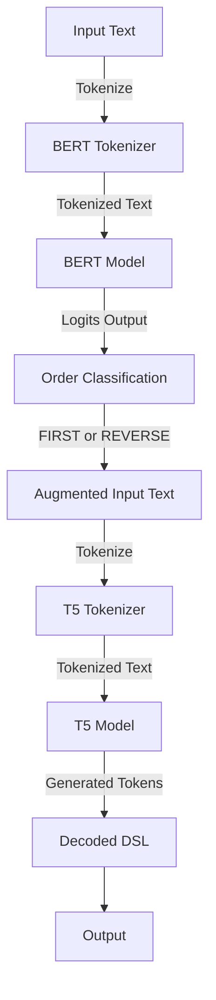

```mermaid
graph TD;
    A[Input Text] -->|Tokenize| B[BERT Tokenizer]
    B -->|Tokenized Text| C[BERT Model]
    C -->|Logits Output| D[Order Classification]
    D -->|FIRST or REVERSE| E[Augmented Input Text]
    E -->|Tokenize| F[T5 Tokenizer]
    F -->|Tokenized Text| G[T5 Model]
    G -->|Generated Tokens| H[Decoded DSL]
    H --> I[Output]
```